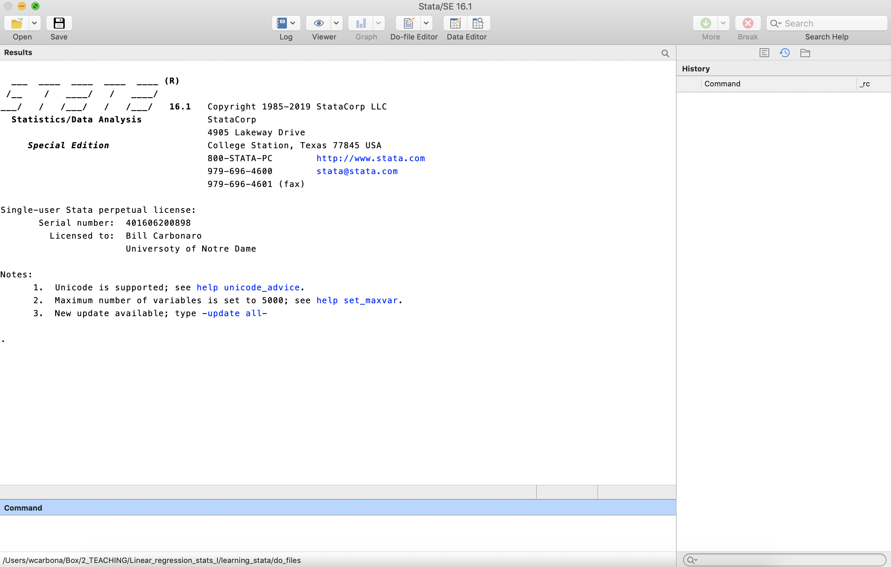

# What is Stata?

Stata is a statistical software package that allows you to conduct statistical
analyses using a data set. If you are familiar with a program like Excel,
then you can think of Stata as Excel on steroids. Just as Excel works with
spreadsheets to peform calculations and produce tables and graphs, Stata allows
you to conduct analyses by applying very complex formulas to very large data sets.
As we will see, Stata also allows you to program and use "scripts"
(called "do files") to

## Let's try this out.

Here's a little test!

Some more content!

### Lorum ipsum

# The components of Stata

 

# What's a `.do` file?

This a "do file" (which has a '.do' file extension). Do files contain instructions
(or "commands") for Stata to execute. The commands in a do
file are inert. Typing commands in a do file does nothing, until you highlight
them and run (or "do") them. At that point, they are submitted to the
"command" prompt in Stata, and they are executed in the order that they are
submitted. You should go ahead and run this do file. Just "select all"
("ctrl" + "A" in Windows, or "command" + "A" in Mac O/S, then click the "do" icon
in the top right corner.  The results will appear in the "Results" window in
Stata.

To this point in the do file, none of the text is considered to be a command by
Stata. It is just text. This is because I opened this do file (see line 1)
with a "/" followed by a "*" (no space). This character combination tells
Stata that the text that follows is not a command. To help the reader
distinguish between non-exectuable text and commands, it makes the non-executable
text green (in the do file editor). Within the do file editor, you will see that
commands in a do file are presented in colors other than green. At the end
of this sentence, I will turn off the commenting with an "*" and a "/", which
will mean that Stata will treat the text on the next line as a command.

```stata
. sysuse auto.dta
(1978 Automobile Data)

```

The text above is a command. Notice that the text appears as blue and black.
It tells Stata to open data set that is stored internally within the program.
'Sysuse' is the command, and 'auto.dta' is the name of the data set. Stata data
sets are saved with a '.dta' extension.

When you are finished with a command, you must include a carriage return ("enter"),
which ends the line and tells Stata the the command is complete. Note that empty
lines (such as 20 and 22) can be included.

What is this "auto" data set? Let's find out.

```stata
. notes

_dta:
  1.  from Consumer Reports with permission

```

This command displays any notes about the data set that have been stored.
If we look at the "Results" window in Stata, we will see that Stata returned
some information regarding where the data come from. Let's add a note to remind
ourselves that the data was collected in 1978.

. note: The data are based on automobiles that were produced in 1978.

. 
. notes

_dta:
  1.  from Consumer Reports with permission
  2.  The data are based on automobiles that were produced in 1978.


Notice how the new note has been added to our data set. This is useful to
keep track of specific things that are important to document about your data.
Keep in mind we would have to save our data set for new to be stored permanently.
More about that later. Let's learn some more about our data set.

```stata
. codebook

----------------------------------------------------------------------------------------------------------------------------
make                                                                                                          Make and Model
----------------------------------------------------------------------------------------------------------------------------

                  type:  string (str18), but longest is str17

         unique values:  74                       missing "":  0/74

              examples:  "Cad. Deville"
                         "Dodge Magnum"
                         "Merc. XR-7"
                         "Pont. Catalina"

               warning:  variable has embedded blanks

----------------------------------------------------------------------------------------------------------------------------
price                                                                                                                  Price
----------------------------------------------------------------------------------------------------------------------------

                  type:  numeric (int)

                 range:  [3291,15906]                 units:  1
         unique values:  74                       missing .:  0/74

                  mean:   6165.26
              std. dev:    2949.5

           percentiles:        10%       25%       50%       75%       90%
                              3895      4195    5006.5      6342     11385

----------------------------------------------------------------------------------------------------------------------------
mpg                                                                                                            Mileage (mpg)
----------------------------------------------------------------------------------------------------------------------------

                  type:  numeric (int)

                 range:  [12,41]                      units:  1
         unique values:  21                       missing .:  0/74

                  mean:   21.2973
              std. dev:    5.7855

           percentiles:        10%       25%       50%       75%       90%
                                14        18        20        25        29

----------------------------------------------------------------------------------------------------------------------------
rep78                                                                                                     Repair Record 1978
----------------------------------------------------------------------------------------------------------------------------

                  type:  numeric (int)

                 range:  [1,5]                        units:  1
         unique values:  5                        missing .:  5/74

            tabulation:  Freq.  Value
                             2  1
                             8  2
                            30  3
                            18  4
                            11  5
                             5  .

----------------------------------------------------------------------------------------------------------------------------
headroom                                                                                                      Headroom (in.)
----------------------------------------------------------------------------------------------------------------------------

                  type:  numeric (float)

                 range:  [1.5,5]                      units:  .1
         unique values:  8                        missing .:  0/74

            tabulation:  Freq.  Value
                             4  1.5
                            13  2
                            14  2.5
                            13  3
                            15  3.5
                            10  4
                             4  4.5
                             1  5

----------------------------------------------------------------------------------------------------------------------------
trunk                                                                                                  Trunk space (cu. ft.)
----------------------------------------------------------------------------------------------------------------------------

                  type:  numeric (int)

                 range:  [5,23]                       units:  1
         unique values:  18                       missing .:  0/74

                  mean:   13.7568
              std. dev:    4.2774

           percentiles:        10%       25%       50%       75%       90%
                                 8        10        14        17        20

----------------------------------------------------------------------------------------------------------------------------
weight                                                                                                         Weight (lbs.)
----------------------------------------------------------------------------------------------------------------------------

                  type:  numeric (int)

                 range:  [1760,4840]                  units:  10
         unique values:  64                       missing .:  0/74

                  mean:   3019.46
              std. dev:   777.194

           percentiles:        10%       25%       50%       75%       90%
                              2020      2240      3190      3600      4060

----------------------------------------------------------------------------------------------------------------------------
length                                                                                                          Length (in.)
----------------------------------------------------------------------------------------------------------------------------

                  type:  numeric (int)

                 range:  [142,233]                    units:  1
         unique values:  47                       missing .:  0/74

                  mean:   187.932
              std. dev:   22.2663

           percentiles:        10%       25%       50%       75%       90%
                               157       170     192.5       204       218

----------------------------------------------------------------------------------------------------------------------------
turn                                                                                                      Turn Circle (ft.) 
----------------------------------------------------------------------------------------------------------------------------

                  type:  numeric (int)

                 range:  [31,51]                      units:  1
         unique values:  18                       missing .:  0/74

                  mean:   39.6486
              std. dev:   4.39935

           percentiles:        10%       25%       50%       75%       90%
                                34        36        40        43        45

----------------------------------------------------------------------------------------------------------------------------
displacement                                                                                          Displacement (cu. in.)
----------------------------------------------------------------------------------------------------------------------------

                  type:  numeric (int)

                 range:  [79,425]                     units:  1
         unique values:  31                       missing .:  0/74

                  mean:   197.297
              std. dev:   91.8372

           percentiles:        10%       25%       50%       75%       90%
                                97       119       196       250       350

----------------------------------------------------------------------------------------------------------------------------
gear_ratio                                                                                                        Gear Ratio
----------------------------------------------------------------------------------------------------------------------------

                  type:  numeric (float)

                 range:  [2.19,3.89]                  units:  .01
         unique values:  36                       missing .:  0/74

                  mean:   3.01486
              std. dev:   .456287

           percentiles:        10%       25%       50%       75%       90%
                              2.43      2.73     2.955      3.37      3.72

----------------------------------------------------------------------------------------------------------------------------
foreign                                                                                                             Car type
----------------------------------------------------------------------------------------------------------------------------

                  type:  numeric (byte)
                 label:  origin

                 range:  [0,1]                        units:  1
         unique values:  2                        missing .:  0/74

            tabulation:  Freq.   Numeric  Label
                            52         0  Domestic
                            22         1  Foreign

```

If we scroll through the "Results" window, we will see that this command
returned detailed information about all of the variables in this data set.
We can also get a more minimalist version of the codebook.

```stata
. codebook, compact

Variable      Obs Unique      Mean   Min    Max  Label
----------------------------------------------------------------------------------------------------------------------------
make           74     74         .     .      .  Make and Model
price          74     74  6165.257  3291  15906  Price
mpg            74     21   21.2973    12     41  Mileage (mpg)
rep78          69      5  3.405797     1      5  Repair Record 1978
headroom       74      8  2.993243   1.5      5  Headroom (in.)
trunk          74     18  13.75676     5     23  Trunk space (cu. ft.)
weight         74     64  3019.459  1760   4840  Weight (lbs.)
length         74     47  187.9324   142    233  Length (in.)
turn           74     18  39.64865    31     51  Turn Circle (ft.)
displacement   74     31  197.2973    79    425  Displacement (cu. in.)
gear_ratio     74     36  3.014865  2.19   3.89  Gear Ratio
foreign        74      2  .2972973     0      1  Car type
----------------------------------------------------------------------------------------------------------------------------

```

This is much easier to process, IMHO! Notice that I inserted a comma before
adding 'compact.' In Stata syntax, a comma denotes options that can be enacted
within specific commands. We can also specify a subset of variables using the
codebook.

```stata
. codebook mpg price trunk foreign, compact

Variable   Obs Unique      Mean   Min    Max  Label
----------------------------------------------------------------------------------------------------------------------------
mpg         74     21   21.2973    12     41  Mileage (mpg)
price       74     74  6165.257  3291  15906  Price
trunk       74     18  13.75676     5     23  Trunk space (cu. ft.)
foreign     74      2  .2972973     0      1  Car type
----------------------------------------------------------------------------------------------------------------------------

. 
. describe

Contains data from /Applications/Stata/ado/base/a/auto.dta
  obs:            74                          1978 Automobile Data
 vars:            12                          13 Apr 2018 17:45
                                              (_dta has notes)
----------------------------------------------------------------------------------------------------------------------------
              storage   display    value
variable name   type    format     label      variable label
----------------------------------------------------------------------------------------------------------------------------
make            str18   %-18s                 Make and Model
price           int     %8.0gc                Price
mpg             int     %8.0g                 Mileage (mpg)
rep78           int     %8.0g                 Repair Record 1978
headroom        float   %6.1f                 Headroom (in.)
trunk           int     %8.0g                 Trunk space (cu. ft.)
weight          int     %8.0gc                Weight (lbs.)
length          int     %8.0g                 Length (in.)
turn            int     %8.0g                 Turn Circle (ft.)
displacement    int     %8.0g                 Displacement (cu. in.)
gear_ratio      float   %6.2f                 Gear Ratio
foreign         byte    %8.0g      origin     Car type
----------------------------------------------------------------------------------------------------------------------------
Sorted by: foreign
     Note: Dataset has changed since last saved.

```

What is the average mpg and price for cars in our data set?

```stata
. summarize mpg price // summary statistics for the 'mpg' variable

    Variable |        Obs        Mean    Std. Dev.       Min        Max
-------------|---------------------------------------------------------
         mpg |         74     21.2973    5.785503         12         41
       price |         74    6165.257    2949.496       3291      15906

```


Do you want to know more about the 'summarize' command?

```stata
. help summarize // Notice - a separate help window opens.

```

In Stata, you can leave notes in three ways. In the command above, we used
double backslashes after entering a command. Thus, a command and a note
can exist on the same line. But the command must always precede the comment.
It is important to note that, when using "//" for comments, it is turned off
when you enter a carriage return and start a new line. That's why this section
has to start with "//" on each line (unlike using ". . . "
for commenting, which is much better for long notes like this).

. * Also - you can begin a line with one or more asterisk to start a note.
. ** See! This is a note too!
.         *** So is this! Note how I used a tab to start the line -- that's OK. ***
. * But asterisks can only trigger comments when they BEGIN a line (unlike the "//").
. * More on that later.


Let's finish up by making a graph.

```stata
scatter mpg price
```


Notice that the graph does not appear in the "Results" window. Instead, there
is a separate window where graphs appear, and can be edited. More later.

Finally -- we are done with our analyses. When we close Stata, our output
in the "Results" window will not be saved, and our graph will disappear. That's
OK -- we can just open our do file, and re-run it and get the same exact output.

To quit Stata, run:

```stata
exit
```
