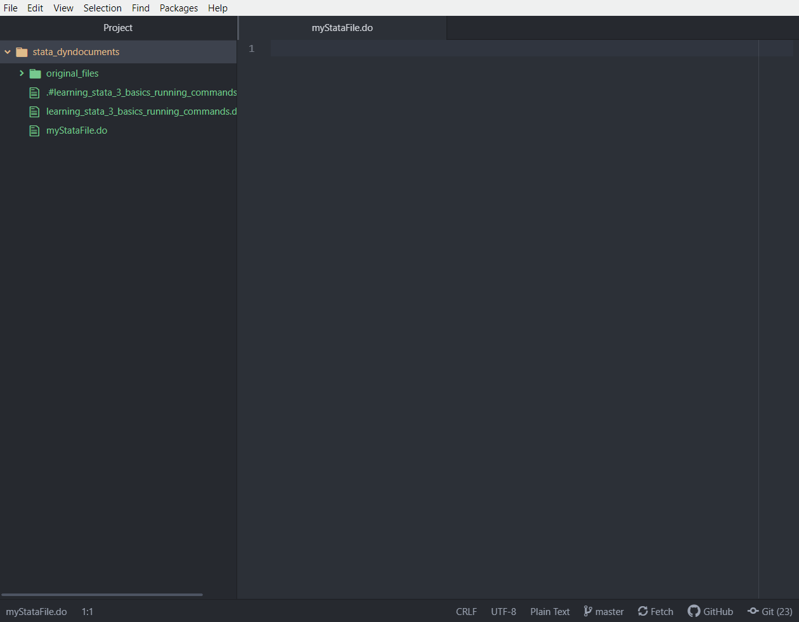

# Introduction: Why use Atom?

When using Stata, most of the work you produce will be created by writing "scripts" which contain instructions for Stata to follow. These scripts are called `.do` files, or "do files." By saving your instructions in a `.do` file, you ensure that you can produce the same results at any point in the future.

Stata provides a built-in interface for users to create and edit `.do` files. You can see an example program being written in this editor below:

For many people, this works well enough. If you are just getting started with Stata, this should be serviceable enough for you to do most of your work. However, if you wish to have a more powerful and flexible workspace, [the text editor Atom](https://atom.io/) has an amazing collection of tools which can make working with Stata feel much nicer. You can see some of the things Atom makes possible below:

(*Source: 'https://atom.io/packages/language-stata'*)

## What is Atom?

Atom is a *text editor*. A text editor is just a program which lets you write files which people can read. They can write any kind of file, too; for example, you can create files which end in `.do` (which are Stata instructions), but you can also create:

- `.md` files (Markdown files for writing prose)
- `.domd` files (Stata's file extension for Markdown files with Stata code)
- `.py` files (the file extension for Python files)
- `.R` files (files for R)
- `.C` files (source code for programs written in C)
- Pretty much anything else you can imagine

Although some text editors may be tied to another program, such as the text editor in Stata or RStudio, others are standalone programs. Popular standalone editors include Notepad++, Sublime Text, Vim, Emacs, Micro, and Atom. These editors are all extremely powerful and customizable. Additionally, they're all supported by very active communities who are constantly producing new tools for them. Many of these editors are open source, which allows tech-savy individuals to extend what these editors are capable of doing. Note that these are distinct from word processors like Microsoft Word or Google Docs, which are frequently refered to as WYSIWYG (What You See Is What You Get) processors.

Atom also has a suite of tools which make it possible to easily put your Stata code and prose for your research papers into the same file. However, since this is a slightly more complicated topic, we will postpone discussing it until a later lesson.

Let's get Atom set up and working properly.

# What you need to get set up

In order to use Stata with Atom, you will need the following tools:

- A working version of Stata
- [The text editor Atom](https://atom.io/)
  - The [language-stata](https://atom.io/packages/language-stata) package (install packages by clicking on `Packages > Settings View > Install Packages/Themes` within Atom)
  - The [hydrogen](https://atom.io/packages/Hydrogen) package (install this the same way as described above)
- To have [Python3](https://www.python.org/downloads/) installed on your computer
  - To have the [Jupyter Stata Kernel](https://kylebarron.dev/stata_kernel/getting_started/) installed on your computer
    - To do this (the link above also gives you instructions), open Terminal if you are using a Mac (you can look for it in the search bar) or Powershell if your are using Windows and enter the following commands:

      ~~~~{.bash}
      pip3 install stata_kernel
      python3 -m stata_kernel.install
      ~~~~

      If you have any problems with this, you can look [here for more information](https://kylebarron.dev/stata_kernel/getting_started/).

Once you have these tools installed, you are ready to use Atom.

# Working with Atom

If you open Atom, you should be greeted by the Welcome screen and the Welcome Guide. Most of the time, you'll want to open a project or install a package. You can do either of these things with the bar at the top as well. To open a file, use `File > Open...` or `File > Reopen Project`. For packages, use `Packages > Settings View > Install Packages/Themes`.

Most of the keyboard shortcuts you're familiar with should work similarly within Atom.

- Cmd-x cuts text
- Cmd-v pastes
- Cmd-c copies
- Cmd-z undoes whatever you just did

... etc. It has a robust find-and-replace feature too.

In addition, Atom can do lots of cool things which Word and Stata's editor *cannot* do. For example, Atom already organizes your open files like tabs on your web-browser, but it also lets you have multiple "Panes" open at once. You can think of panes as groups of tabs which you might want to view side-by-side. It also has autocompletion for your Stata code built-in.

At the *bare minimum*, you should have the following installed at this point:

- Python 3
- The Stata Jupyter Kernel
- The language-stata Atom package
- The hydrogen Atom package

If you do not have any of these installed, go back to the setup section and install them now.

## Making a new Stata file

Simply make a new file and rename it so that it ends with the extension `.do`, such as `myfile.do`. Atom will automatically understand you are writing a Stata file, and it will enable the relevant functionality.

## Running Stata code

You can write and execute code contained within your `.do` files in Atom. In addition, Atom will automatically give you syntax highlighting, auto complete, and more. Run your commands by highlighting sections of text (to run several lines of code) or placing your cursor within a line (to run a single line of code) and hitting `Shift-Enter`.

## Using auto-complete

You should be able to automatically complete commands you have started to type by hitting `Tab` when Atom presents you with a muted suggestion of the complete word.
