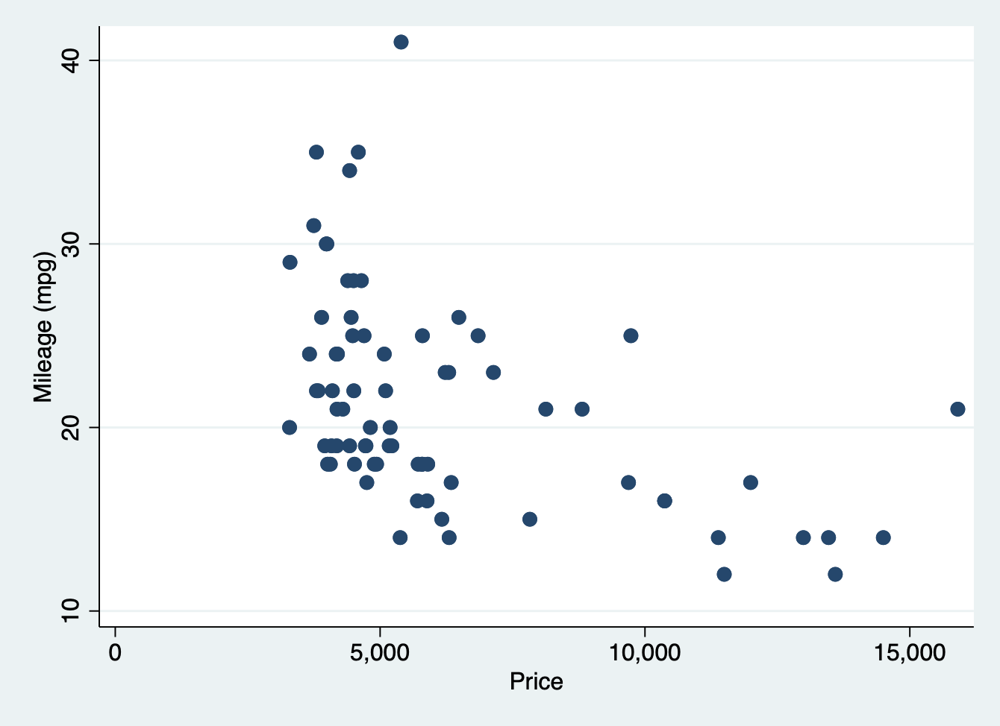

# Using your workspace

If you are planning on using Atom, open the program and create a new file with
the extension `.do` (e.g. `myStataFile.do`). You will likely need to explicitly
save the file with a name before you can begin working on it.


Alternatively, if you are not using Atom, open up the Stata window. You can run
commands within the Stata console without creating a `.do` file, but you will
want to create one when running your own analyses; if you do not, you will find
it immensely difficult to reproduce your findings (in short, always make a `.do`
file).


 
## What's a `.do` file?

`.do` files are simply any file which has a '`.do`' file extension. `.do` files
contain instructions (or "commands") for Stata to execute. The commands in a do
file are inert. Typing commands in a `.do` file does nothing, until you
highlight them and run (or "do") them. At that point, they are submitted to the
"command" prompt in Stata, and they are executed in the order that they are
submitted. In the next lesson, we will discuss creating well-organized and
readable `.do` files in more depth.


# Running Stata commands

First, type the following into your `.do` file:

```stata
sysuse auto.dta
```

The text above is a command. It tells Stata to open data set that is stored
internally within the program. `Sysuse` is the command, and `auto.dta` is the
name of the data set. Stata data sets are saved with a `.dta` extension.

When you are finished with a command, you must include a carriage return (by
hitting "enter"), which ends the line and tells Stata the the command is
complete. Note that empty lines can be included; these are helpful for making
your code more easy to read.

If you are using Atom, you should be able to run this command by placing your
cursor on the line with the command and hitting either "ctrl" + "enter" or
"shift" + "enter" (there are many different ways to execute commands in Atom.
For a list, hit "ctrl" + "uparrow" + "P" or "cmd" + "uparrow" + "P"). The
results should be displayed below the code. If you are using the Stata window,
just "select all" ("ctrl" + "A" in Windows, or "cmd" + "A" in Mac O/S) and then
click the "do" icon in the top right corner. The results will appear in the
"Results" window in Stata.


## Stata comments (or, prose within your instructions)

```stata
/* Here is my comment. */
```

If you run a `.do` file containing the code above, nothing will happen. This is
because I opened the `.do` file with a "/" followed by a "\*" (no space). This
character combination tells Stata that the text that follows is not a command.
To help the reader distinguish between non-exectuable text and commands, your
text editor will make the non-executable text a different color than those which
are not demarcated as comments. Within the `.do` file editor (regardless of
whether your are using Atom or Stata's GUI), you will see that commands in a `.do`
file are presented in different colors. Your comments can span multiple lines; to end them, write "*/". The next line Stata reads will be interpreted as a command.

## Creating notes

What is this "auto" data set? Let's find out.

```stata
. notes

_dta:
  1.  From Consumer Reports with permission

```

This command displays any notes about the data set that have been stored.
If we look at the "Results" window in Stata, we will see that Stata returned
some information regarding where the data come from. Let's add a note to remind
ourselves that the data was collected in 1978.

```stata
. note: The data are based on automobiles that were produced in 1978.

. 
. notes

_dta:
  1.  From Consumer Reports with permission
  2.  The data are based on automobiles that were produced in 1978.

```

Notice how the new note has been added to our data set. This is useful to
keep track of specific things that are important to document about your data.
Keep in mind we would have to save our data set for new to be stored permanently.
We will discuss that later.


# An overview of exploring your data

Let's learn some more about our data set.

```stata
. codebook

------------------------------------------------------------------------------------------------------------------------------------------------
make                                                                                                                              Make and model
------------------------------------------------------------------------------------------------------------------------------------------------

                  Type: String (str18), but longest is str17

         Unique values: 74                        Missing "": 0/74

              Examples: "Cad. Deville"
                        "Dodge Magnum"
                        "Merc. XR-7"
                        "Pont. Catalina"

               Warning: Variable has embedded blanks.

------------------------------------------------------------------------------------------------------------------------------------------------
price                                                                                                                                      Price
------------------------------------------------------------------------------------------------------------------------------------------------

                  Type: Numeric (int)

                 Range: [3291,15906]                  Units: 1
         Unique values: 74                        Missing .: 0/74

                  Mean: 6165.26
             Std. dev.:  2949.5

           Percentiles:     10%       25%       50%       75%       90%
                           3895      4195    5006.5      6342     11385

------------------------------------------------------------------------------------------------------------------------------------------------
mpg                                                                                                                                Mileage (mpg)
------------------------------------------------------------------------------------------------------------------------------------------------

                  Type: Numeric (int)

                 Range: [12,41]                       Units: 1
         Unique values: 21                        Missing .: 0/74

                  Mean: 21.2973
             Std. dev.:  5.7855

           Percentiles:     10%       25%       50%       75%       90%
                             14        18        20        25        29

------------------------------------------------------------------------------------------------------------------------------------------------
rep78                                                                                                                         Repair record 1978
------------------------------------------------------------------------------------------------------------------------------------------------

                  Type: Numeric (int)

                 Range: [1,5]                         Units: 1
         Unique values: 5                         Missing .: 5/74

            Tabulation: Freq.  Value
                            2  1
                            8  2
                           30  3
                           18  4
                           11  5
                            5  .

------------------------------------------------------------------------------------------------------------------------------------------------
headroom                                                                                                                          Headroom (in.)
------------------------------------------------------------------------------------------------------------------------------------------------

                  Type: Numeric (float)

                 Range: [1.5,5]                       Units: .1
         Unique values: 8                         Missing .: 0/74

            Tabulation: Freq.  Value
                            4  1.5
                           13  2
                           14  2.5
                           13  3
                           15  3.5
                           10  4
                            4  4.5
                            1  5

------------------------------------------------------------------------------------------------------------------------------------------------
trunk                                                                                                                      Trunk space (cu. ft.)
------------------------------------------------------------------------------------------------------------------------------------------------

                  Type: Numeric (int)

                 Range: [5,23]                        Units: 1
         Unique values: 18                        Missing .: 0/74

                  Mean: 13.7568
             Std. dev.:  4.2774

           Percentiles:     10%       25%       50%       75%       90%
                              8        10        14        17        20

------------------------------------------------------------------------------------------------------------------------------------------------
weight                                                                                                                             Weight (lbs.)
------------------------------------------------------------------------------------------------------------------------------------------------

                  Type: Numeric (int)

                 Range: [1760,4840]                   Units: 10
         Unique values: 64                        Missing .: 0/74

                  Mean: 3019.46
             Std. dev.: 777.194

           Percentiles:     10%       25%       50%       75%       90%
                           2020      2240      3190      3600      4060

------------------------------------------------------------------------------------------------------------------------------------------------
length                                                                                                                              Length (in.)
------------------------------------------------------------------------------------------------------------------------------------------------

                  Type: Numeric (int)

                 Range: [142,233]                     Units: 1
         Unique values: 47                        Missing .: 0/74

                  Mean: 187.932
             Std. dev.: 22.2663

           Percentiles:     10%       25%       50%       75%       90%
                            157       170     192.5       204       218

------------------------------------------------------------------------------------------------------------------------------------------------
turn                                                                                                                           Turn circle (ft.)
------------------------------------------------------------------------------------------------------------------------------------------------

                  Type: Numeric (int)

                 Range: [31,51]                       Units: 1
         Unique values: 18                        Missing .: 0/74

                  Mean: 39.6486
             Std. dev.: 4.39935

           Percentiles:     10%       25%       50%       75%       90%
                             34        36        40        43        45

------------------------------------------------------------------------------------------------------------------------------------------------
displacement                                                                                                              Displacement (cu. in.)
------------------------------------------------------------------------------------------------------------------------------------------------

                  Type: Numeric (int)

                 Range: [79,425]                      Units: 1
         Unique values: 31                        Missing .: 0/74

                  Mean: 197.297
             Std. dev.: 91.8372

           Percentiles:     10%       25%       50%       75%       90%
                             97       119       196       250       350

------------------------------------------------------------------------------------------------------------------------------------------------
gear_ratio                                                                                                                            Gear ratio
------------------------------------------------------------------------------------------------------------------------------------------------

                  Type: Numeric (float)

                 Range: [2.19,3.89]                   Units: .01
         Unique values: 36                        Missing .: 0/74

                  Mean: 3.01486
             Std. dev.: .456287

           Percentiles:     10%       25%       50%       75%       90%
                           2.43      2.73     2.955      3.37      3.72

------------------------------------------------------------------------------------------------------------------------------------------------
foreign                                                                                                                               Car origin
------------------------------------------------------------------------------------------------------------------------------------------------

                  Type: Numeric (byte)
                 Label: origin

                 Range: [0,1]                         Units: 1
         Unique values: 2                         Missing .: 0/74

            Tabulation: Freq.   Numeric  Label
                           52         0  Domestic
                           22         1  Foreign

```

If we scroll through the "Results" window, we will see that this command
returned detailed information about all of the variables in this data set.
We can also get a more minimalist version of the codebook.

```stata
. codebook, compact

Variable      Obs Unique      Mean   Min    Max  Label
------------------------------------------------------------------------------------------------------------------------------------------------
make           74     74         .     .      .  Make and model
price          74     74  6165.257  3291  15906  Price
mpg            74     21   21.2973    12     41  Mileage (mpg)
rep78          69      5  3.405797     1      5  Repair record 1978
headroom       74      8  2.993243   1.5      5  Headroom (in.)
trunk          74     18  13.75676     5     23  Trunk space (cu. ft.)
weight         74     64  3019.459  1760   4840  Weight (lbs.)
length         74     47  187.9324   142    233  Length (in.)
turn           74     18  39.64865    31     51  Turn circle (ft.)
displacement   74     31  197.2973    79    425  Displacement (cu. in.)
gear_ratio     74     36  3.014865  2.19   3.89  Gear ratio
foreign        74      2  .2972973     0      1  Car origin
------------------------------------------------------------------------------------------------------------------------------------------------

```

This is much easier to process, in my humble opinion! Notice that I inserted a
comma before adding 'compact.' In Stata syntax, a comma denotes options that can
be enacted within specific commands. We can also specify a subset of variables
using the codebook.

```stata
. codebook mpg price trunk foreign, compact

Variable   Obs Unique      Mean   Min    Max  Label
------------------------------------------------------------------------------------------------------------------------------------------------
mpg         74     21   21.2973    12     41  Mileage (mpg)
price       74     74  6165.257  3291  15906  Price
trunk       74     18  13.75676     5     23  Trunk space (cu. ft.)
foreign     74      2  .2972973     0      1  Car origin
------------------------------------------------------------------------------------------------------------------------------------------------

. 
. describe

Contains data from /Applications/Stata/ado/base/a/auto.dta
 Observations:            74                  1978 automobile data
    Variables:            12                  13 Apr 2020 17:45
                                              (_dta has notes)
------------------------------------------------------------------------------------------------------------------------------------------------
Variable      Storage   Display    Value
    name         type    format    label      Variable label
------------------------------------------------------------------------------------------------------------------------------------------------
make            str18   %-18s                 Make and model
price           int     %8.0gc                Price
mpg             int     %8.0g                 Mileage (mpg)
rep78           int     %8.0g                 Repair record 1978
headroom        float   %6.1f                 Headroom (in.)
trunk           int     %8.0g                 Trunk space (cu. ft.)
weight          int     %8.0gc                Weight (lbs.)
length          int     %8.0g                 Length (in.)
turn            int     %8.0g                 Turn circle (ft.)
displacement    int     %8.0g                 Displacement (cu. in.)
gear_ratio      float   %6.2f                 Gear ratio
foreign         byte    %8.0g      origin     Car origin
------------------------------------------------------------------------------------------------------------------------------------------------
Sorted by: foreign
     Note: Dataset has changed since last saved.

```

What is the average mpg and price for cars in our data set?

```stata
. summarize mpg price // summary statistics for the 'mpg' variable

    Variable |        Obs        Mean    Std. dev.       Min        Max
-------------+---------------------------------------------------------
         mpg |         74     21.2973    5.785503         12         41
       price |         74    6165.257    2949.496       3291      15906

```

## Getting help

Do you want to know more about the 'summarize' command? There's a command for
that:

```stata
. help summarize // Notice - a separate help window opens.

```

## Brief comments

In Stata, you can leave comments in three ways. In the command above, we used
double backslashes after entering a command. Thus, a command and a note
can exist on the same line. But the command must always precede the comment.
It is important to note that, when using "//" for comments, it is turned off
when you enter a carriage return and start a new line.

```stata
. * Also - you can begin a line with one or more asterisk to start a note.
. ** See! This is a note too!
.         *** So is this! Note how I used a tab to start the line -- that's OK. ***
. * But asterisks can only trigger comments when they BEGIN a line (unlike the "//").
. * More on that later.
```

# A quick graph

Let's finish up by making a graph.

```stata
scatter mpg price
```



If you are using the Stata GUI, notice that the graph does not appear in the
"Results" window. Instead, there is a separate window where graphs appear, and
can be edited. More on that later.

# Wrapping up

Finally -- we are done with our analyses. When we close Stata, our output in the
"Results" window will not be saved, and our graph will disappear. That's OK --
we can just open our `.do` file and re-run it. We should get the same exact
output.

To quit Stata, run:

```stata
exit
```
